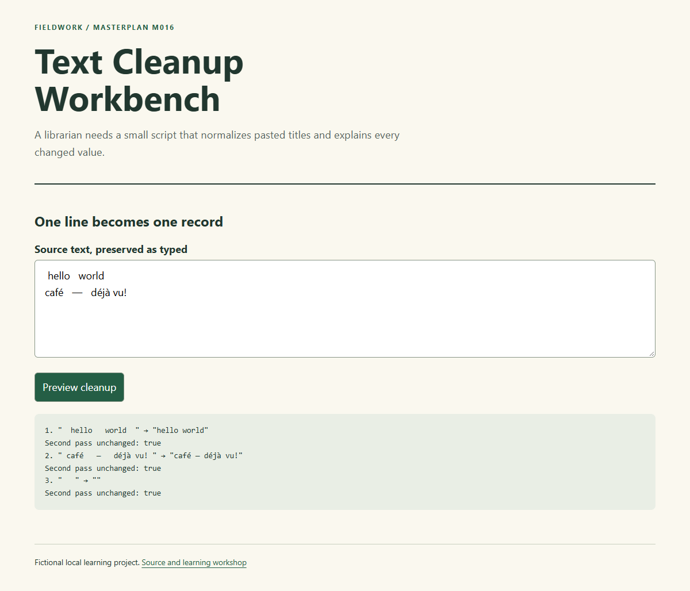

# M016 — Text Cleanup Workbench

A librarian needs a small script that normalizes pasted titles and explains every changed value.

This is a complete small **reference implementation and learning workshop** for MASTERPLAN builds M011–M025. Study the choices, then make your own variation. The reference is finished; the exercises and your journal are deliberately unfinished.

**Main skill:** Pure transformations and idempotence. **Study pairing:** existing curriculum #16, [unionboot](https://github.com/elirc/unionboot). [Previous](https://github.com/elirc/masterplan-015-callback-delivery-simulator) · [Next](https://github.com/elirc/masterplan-017-decision-table-builder)

## Run it

Use Git and Node.js 22 or newer. There are no package dependencies to install.

```sh
git clone https://github.com/elirc/masterplan-016-text-cleanup-workbench.git
cd masterplan-016-text-cleanup-workbench
npm test
npm start
```

Open http://127.0.0.1:4300 and leave the terminal running. Stop with Ctrl+C. Run one project at a time, or use a different PORT for a second server. On PowerShell: `$env:PORT=4301` before `npm start`. The preview serves only public/ on your own computer. For the React builds, npm start first builds the JSX source into an ignored local bundle.

`private: true` in package.json prevents accidental npm publication; it does not make this GitHub repository private. The GitHub repository is intended to be public.

## What the reference promises

Each source line is retained as a record with before and after strings. Cleanup trims both ends and collapses runs of JavaScript whitespace to one ordinary space. It preserves letter case, Unicode characters and punctuation. Empty records remain present. The source array and textarea are not changed, and applying cleanText twice gives the same result as applying it once.

A concrete input-cleaning utility turns standalone exercises into a visible contract.

## Read in this order

1. [Learning route](docs/00-START-HERE.md): a manageable session plan and readiness check.
2. [Build walkthrough](docs/01-BUILD-WALKTHROUGH.md): build from requirements to the smallest verified result.
3. [Concepts and execution traces](docs/02-CONCEPTS-AND-TRACES.md): predict, trace and explain the real code.
4. [Code tour and architecture choices](docs/03-CODE-TOUR.md): exact files and responsibilities.
5. [Debugging laboratory](docs/04-DEBUGGING-LAB.md): one worked diagnosis and two guided investigations.
6. [Six learner stories](docs/05-PRACTICE-STORIES.md): features and fixes with plans, acceptance criteria and decisions left to you.
7. [Hints and answer directions](docs/06-HINTS-AND-ANSWERS.md): consult after an attempt.
8. [Agentic coaching prompts](docs/07-AGENTIC-COACHING.md): ask for help without outsourcing the learning.
9. [Build journal and decision narrative](docs/08-BUILD-JOURNAL.md): a retrospective explanation grounded in the actual implementation.
10. [Verification](docs/VERIFICATION.md) and [blank journal](docs/JOURNAL-TEMPLATE.md).



## Know what the checks prove

npm test runs the pure JavaScript boundary regressions. Browser evidence separately covers form interaction, error recovery, layout and keyboard entry.

This is a local educational example with fictional content. There is no production deployment, external data integration, tracking, authentication or payment flow. Do not mistake the deliberately small scope for a template that already solves those additional concerns.

## Your first independent task

Count changed records: Derive a count from before !== after and display it alongside total rows. Read its acceptance criteria, create a practice branch, and write your prediction before changing code. Keep your personal notes in `my-journal/`, which is ignored by Git.
